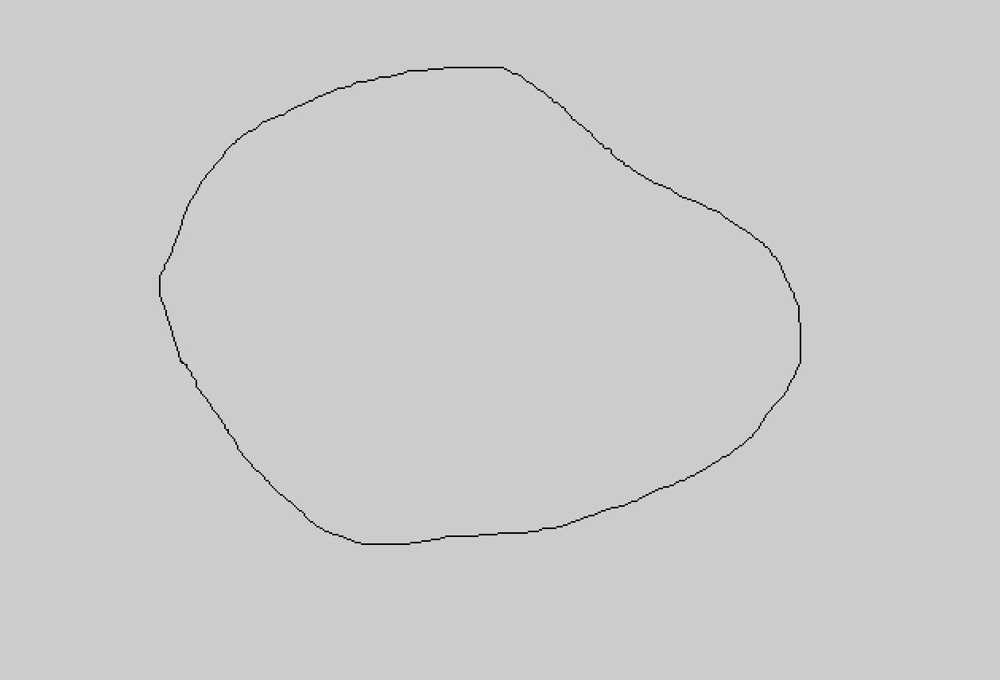

# A Sketching Interface for 3D Freeform Design #
Our final project for CMSC 435: An OpenGL implementation of [Teddy: A Sketching Interface for 3D Freeform Design](http://www-ui.is.s.u-tokyo.ac.jp/~takeo/papers/siggraph99.pdf)

***

## Getting Started ##
The `Makefile` provided handles compilation tasks, and currently works on
Linux and OSX (sorry Windows users). The `Makefile` comes with handy `run` and
`clean` commands to avoid any confusion. To compile, run, and clean the program,
simply perform the following:

* `$ make`
* `$ make run`
* `$ make clean`

Refer to the [Makefile](Makefile) for further details.

When the program loads, you will be presented with a light gray window. This is
the __Drawing__ state, in which you may draw a 2D stroke. This has only been
tested with mouse & trackpad drawing. 

When you wish to generate the 3D model of your 2D shape, transition to the
3D __Viewing__ state.

_(Please refer to the [Input section](#keyboard-&-mouse-input) below)_

Our program depends on the [Eigen linear algebra library](http://eigen.tuxfamily.org/index.php?title=Main_Page),
which is currently included in the `libs` directory within the main project
directory. The program's Makefile looks for additional libraries within the `libs`
directory, so be sure to place any additions libraries there. Of course, you
aren't required to do this, but it keeps the project source uncluttered.

***

## Keyboard & Mouse Input ##
Our program currently requires the user to input specific keystrokes & mouse
movement to trigger specific functionality.

### Mouse Input ###
| Action                  | Function                         |
|-------------------------|----------------------------------|
| `mouse_down+drag`       | (Drawing) Create Freeform Sketch |
|                         | (Viewing) Rotate                 |
| `shift+mouse_down+drag` | (Viewing) Pan                    |
| `ctrl+mouse_down+drag`  | (Viewing) Zoom                   |

### Keyboard Input ###
| Key   | Function                                              |
|-------|-------------------------------------------------------|
| `esc` | Terminate the running program                         |
| `2`   | Transition to the Drawing (2D) State                  |
| `3`   | Transition to the Viewing (3D) State                  |
| `L`   | Load an .obj file containing mesh data                |
| `c`   | Clear all data for current drawing                    |
| `l`   | Toggle lighting within the Viewing State              |
| `v`   | Toggle highlighted mesh vertices in the Viewing State |
| `t`   | Toggle 2D Triangulation within the Drawing State      |

***

## Known Issues ##
### UMBC GL Machine Support ###
At some point during development, the functionality of rendering the 3D model
on UMBC's GL machine was lost. Unfortunately, we're not sure why this issue
occurs, and we have had no luck finding an answer. If you (the grader) run the
program on the GL machine and have this issue, please [Contact Us](#contact-us).

### Triangulation ###
Our math isn't perfect. The program, in its current state, is very fragile in
terms of triangulating the 2D freeform drawing. In the case of complex shapes,
the program will likely return a 3D model that is dissimilar to your 2D sketch.
Please keep in mind that this is very much a prototype with minimal testing.

### Lighting ###
Due to time constraints and lack of OpenGL experience, the lighting within
__Viewing__ state is fixed to the model, resulting in the undesired behavior of
the light rotating with the model. As a simple, yet gross, workaround for the
issue of the back of the model being dark, we simply added another light
shining on the back of the model.

### Viewing State Rotation ###
The math behind the Trackball implementation isn't quite right, so the model
rotation feels somewhat clunky, and the model can be panned off the screen.

***

## Contact Us ##
We are aware that this program isn't perfect. What is presented was built in
less than half the semester, so exhaustive testing wasn't a realistic option.
If you have any issues, please contact the creators:

* Travis Hunt (he40014@umbc.edu)
* Evan Flesher (flesher1@umbc.edu)